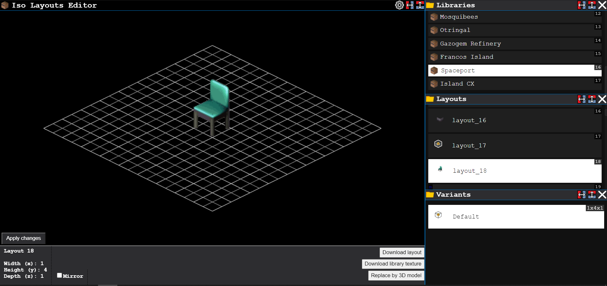

# Art workflow

In case you're new to this project, welcome!

These instructions describe the art workflow. They will explain how to properly create art assets, provide some technical details for how and why we do things, and describe best practices.

## Artistic goal

The goal is to adhere to the original art style of LBA as much as possible. Sometimes, liberties have to be taken in filling in previously unseen angles of assets. Also, due to the lower resolution of the original visuals, smaller details sometimes have to be interpreted by the artist. When we do, we try to respect the original art style as much as we can.

## Software

The modelling software we use is [Blender](https://www.blender.org/download/). (Note: if you're experiencing issues with importing .dae files, Blender v2.82 is a known version to *not* have issues with that.)

In the current phase of the project, textures are seldom applied, so texturing software has low relevance.

If you're using any kind of proprietary software, please make sure your copy has been properly licensed/purchased, and that the source/export files can also be opened/edited by open source alternatives to the used software.

## Replacing 3D isometric layouts

#### 

##### 3D isometric layouts

When enabling the '3D Isometric' view mode in this project, the game shows the original flat-image LBA 'Layouts' (the name for a prop or object) projected onto generated 3D meshes. 

##### Why do we want to replace them?

Because of the lack of actual 3D information in the original layout bitmaps, the 'projected' 3D isometric result is not able to correctly show what assets look like from other angles than the original isometric view point. This causes stretching, and areas that are simply absent (such as the back side of objects). 

##### Downloading an original 3D isometric layout as reference for creating the replacement

These layouts can be downloaded from the Layout Editor by pressing the "Download Layout" button when having a Layout selected in the Iso Layout Editor. They will download as *.dae format files. 

After importing them into Blender, they can serve as a basis/reference for modelling the replacing asset in terms of shape, size and dimensions. 

Also note, that the *.dae files do not self-contain textures, which will have to be downloaded separately by pressing the "Download Library Texture" button. This will download a shared texture atlas image which will correctly map to all Layouts that are downloaded from that Library.

##### Creating the replacement 3D layout

A replacement 3D layout should be exported as a GLB file and placed inside the `www\models\layouts\` folder in the project repository. It can then be applied by pressing the "Replace by 3D model" button, and selecting the export in the drop down menu. By pressing the "Apply Changes" button, we ensure the environments are correctly optimized to make use of this asset.

The end goal is to replace all of the projected 3D isometric assets with newly made 'true 3D' versions, so they look complete and correct from all perspectives.

##### Source files folder

We store our 'source files', such as Blender scenes (and possibly other types of source files in the future), in a specific folder called assetsSource, which can be found in the root of the project repository.

- TBD: define clear best-practices on internal folder structure, Blender file naming and Blender scene setup.

## Naming convention

For new 3D layout exports, the name should look something like this:

`GB_082_088_wall_lamp_var02.glb`

- The GB stands for Gray Buildings, which is the Layout Library the asset belongs to. (see 'Layout Library prefixes')
- The number(s) that follow(s) represent which Layouts should use this asset. This can be multiple numbers, for instance if a layout used in different orientations.
- The actual name of the object is up to us to define. Anything descriptive will do, as long as it's not overly lengthy. We stick to lowercase, and spaces are represented by underscores.
- The 'Var02' represents a Layout Variant. These can be found in the editor under the Variants panel. Variants can for instance be a longer/shorter version of a Layout, or a part that has been split off. This suffix is used for actual Variant exports, starting from 'var01' (so, we do not name the main Layout 'var0' or anything like that).

##### Layout Library prefixes

- **CI** - Citadel Island
- **SE** - Sewers
- **GB** - Gray Buildings
- **CA** - Caves
- **EM** - Emerald Moon
- **DI** - Desert Island
- **ES** - Esmer Shuttle
- **ZF** - Zeelich Factories
- **IH** - Imperial Hotel
- **EP** - Emperor's Palace
- **DM** - Dark Monk Statue
- **UG** - Undergas
- **MO** - Mosquibees
- **OT** - Otringal
- **GR** - Gazogem Refinery
- **FI** - Francos Island
- **SP** - Spaceport
- **CX** - Island CX

## Color palettes

TBD

## Best practices

TBD

## Replacing 'island' (exterior scene) models

Not supported yet, but might become possible in the future.

## Replacing character models

Not supported yet, but might become possible in the future.
